# Day 13 Observability Lab Individual Report

> **Instruction**: This is an individual submission. Tags such as `[GROUP_NAME]`, `[MEMBERS]`, and `[MEMBER_A_NAME]` are preserved for automated grading compatibility.

## 1. Individual Metadata
- [GROUP_NAME]: Individual - 2A202600757 - Doan Minh Quang - Day 13
- [REPO_URL]: https://github.com/dquangai/2A202600757-DoanMinhQuang-Day13.git
- [MEMBERS]:
  - Individual: Doan Minh Quang | Student ID: 2A202600757 | Roles: Logging, PII, Tracing, SLO, Alerts, Load Test, Dashboard, Incident Response, Evidence, Report

---

## 2. Individual Performance (Auto-Verified)
- [VALIDATE_LOGS_FINAL_SCORE]: 100/100
- [TOTAL_TRACES_COUNT]: >= 10 traces captured in Langfuse evidence
- [PII_LEAKS_FOUND]: 0

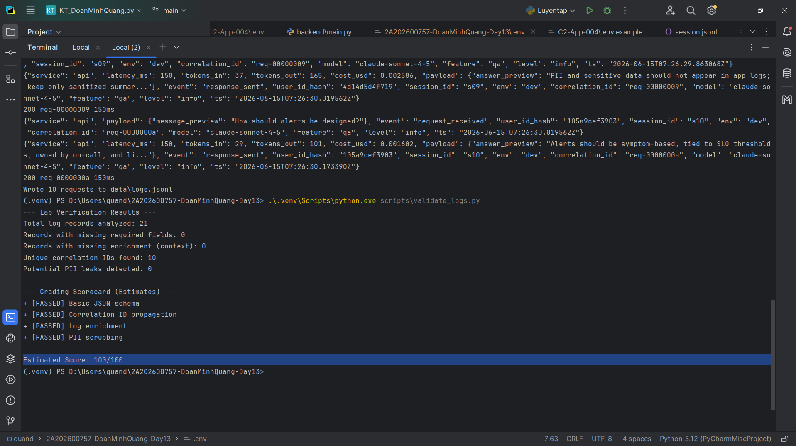

---

## 3. Technical Evidence (Individual)

### 3.1 Logging & Tracing
- [EVIDENCE_CORRELATION_ID_SCREENSHOT]: `docs/evidence/correlation_id.png`
- [EVIDENCE_PII_REDACTION_SCREENSHOT]: `docs/evidence/redacted-email.png`, `docs/evidence/redacted-phone-vn.png`, `docs/evidence/redacted-credit-card.png`
- [EVIDENCE_TRACE_WATERFALL_SCREENSHOT]: `docs/evidence/langfuse-trace-waterfall.png`
- [TRACE_WATERFALL_EXPLANATION]: The agent trace contains the top-level `LabAgent.run` span plus nested `retrieve` and `FakeLLM.generate` observations, so `rag_slow` can be localized to retrieval while normal generation remains stable.

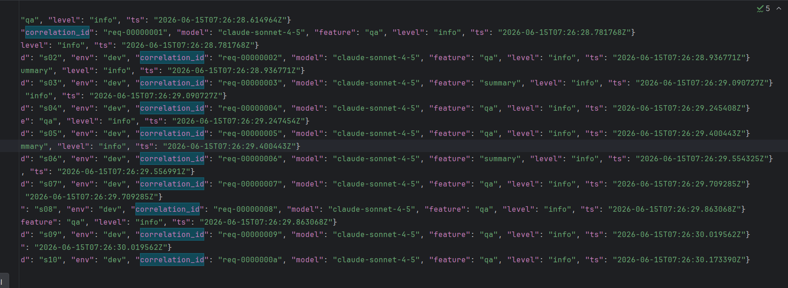

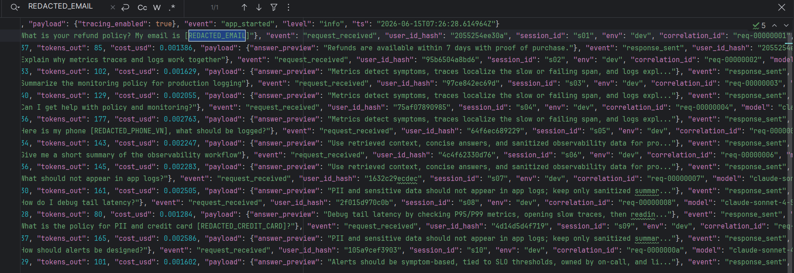

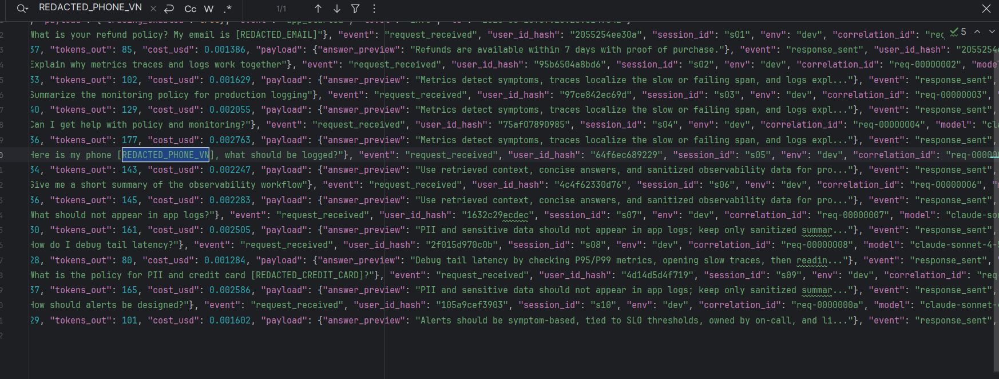

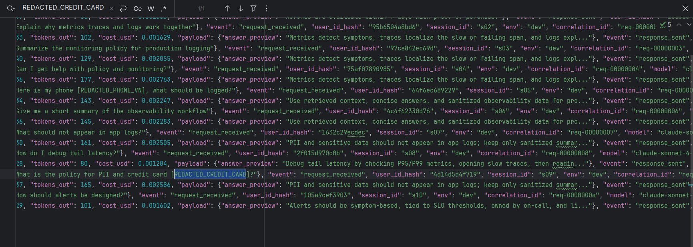

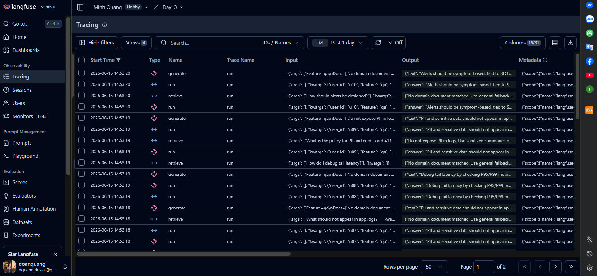

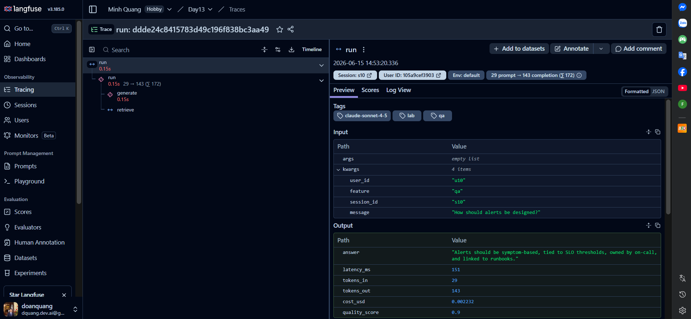

### 3.2 Dashboard & SLOs
- [DASHBOARD_6_PANELS_SCREENSHOT]: `docs/evidence/dashboard-baseline.png`
- [SLO_TABLE]:
| SLI | Target | Window | Current Value |
|---|---:|---|---:|
| Latency P95 | < 3000ms | 28d | 151ms local sample |
| Error Rate | < 2% | 28d | 0.00% local sample |
| Cost Budget | < $2.5/day | 1d | $0.0212 local sample |

### 3.3 Alerts & Runbook
- [ALERT_RULES_SCREENSHOT]: `docs/evidence/alert-rules-yaml.png`, `docs/evidence/alerts-md.png`
- [SAMPLE_RUNBOOK_LINK]: `docs/alerts.md#1-high-latency-p95`

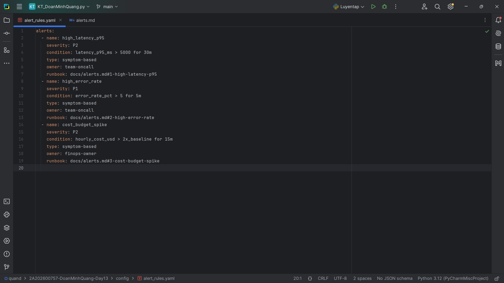

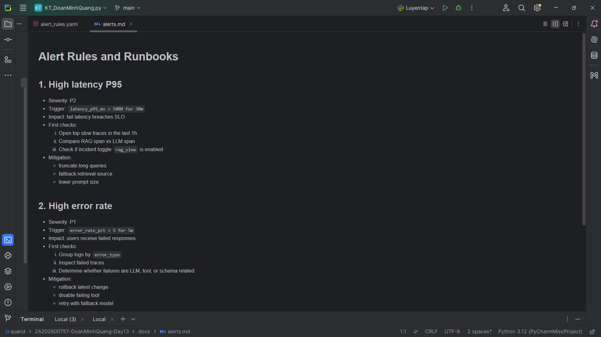

---

## 4. Incident Response (Individual)
- [SCENARIO_NAME]: rag_slow
- [SYMPTOMS_OBSERVED]: P95 latency rises above the normal ~150ms baseline when retrieval delay is injected.
- [ROOT_CAUSE_PROVED_BY]: `docs/evidence/incident-rag-slow-load-test.png`, `docs/evidence/dashboard-rag-slow.png`, and `docs/evidence/langfuse-trace-waterfall.png`
- [FIX_ACTION]: Disable `rag_slow`, inspect retrieval backend, and fall back to a cached or smaller retrieval set.
- [PREVENTIVE_MEASURE]: Keep the `high_latency_p95` alert and use trace span tags to separate RAG latency from LLM latency.

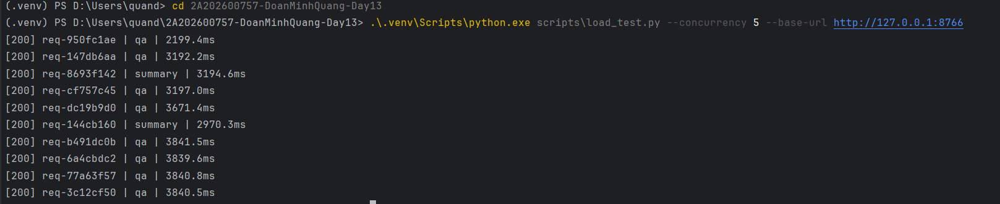

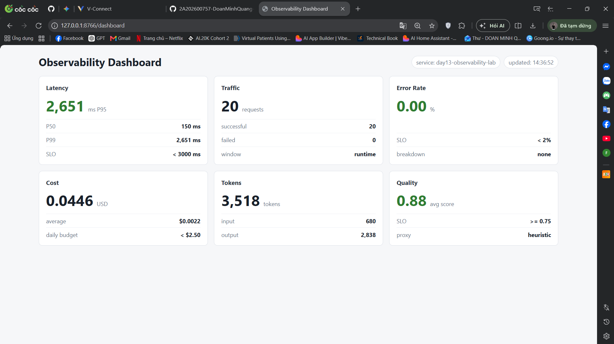

---

## 5. Individual Contributions & Evidence

### [MEMBER]: Doan Minh Quang
- [TASKS_COMPLETED]: Implemented recursive PII scrubbing, log processor redaction, correlation ID middleware, request context enrichment, Langfuse tracing, metrics, dashboard, SLOs, alerts, incident evidence, and final report.
- [EVIDENCE_LINK]: `docs/evidence/git-commit.png`

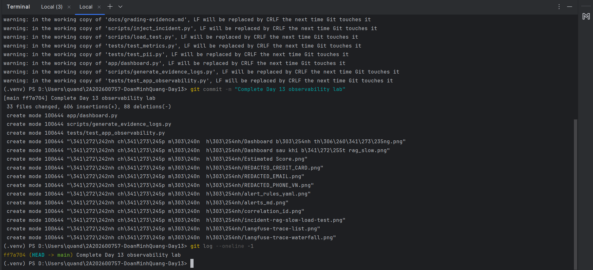

---

## 6. Bonus Items (Optional)
- [BONUS_COST_OPTIMIZATION]: Not claimed
- [BONUS_AUDIT_LOGS]: Claimed. The app writes a separate sanitized `data/audit.jsonl` trail for `/chat` outcomes with `correlation_id`, `user_id_hash`, session, feature, model, status, latency, token, cost, and quality fields. Audit records are covered by tests and use the same PII scrubber as application logs.
- [BONUS_CUSTOM_METRIC]: Error-rate percentage and total error count added to `/metrics`
